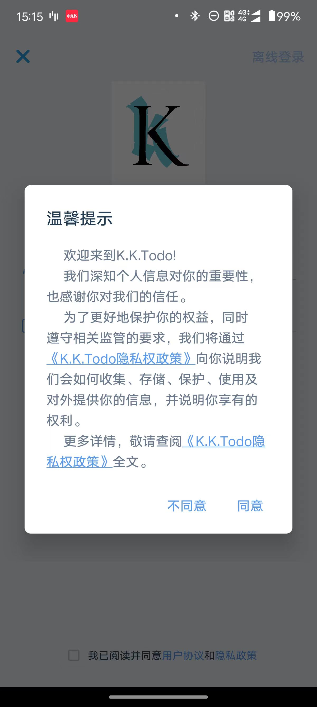
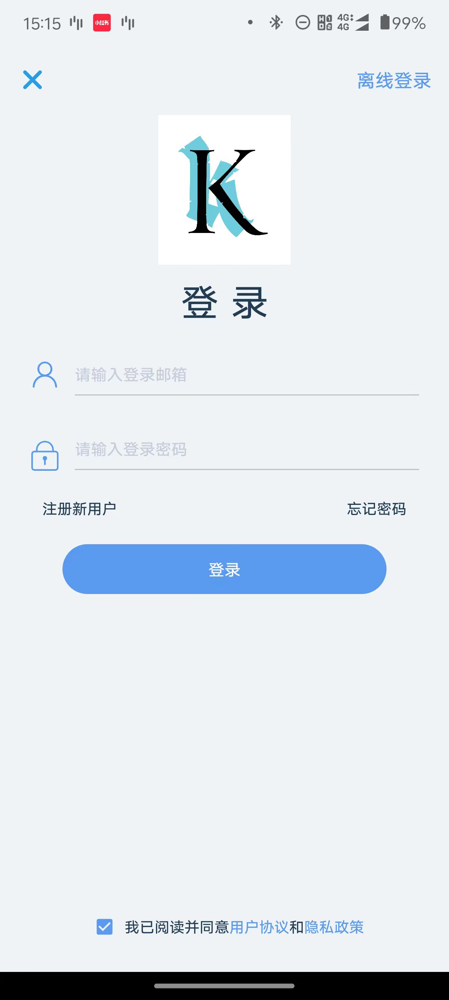
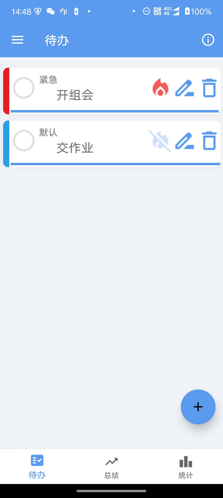
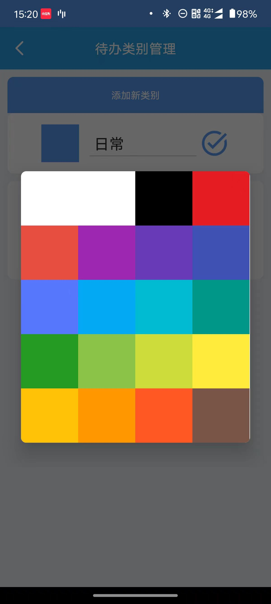
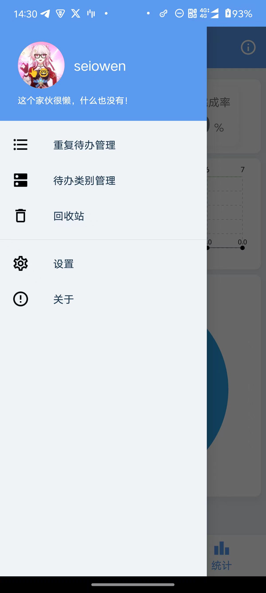
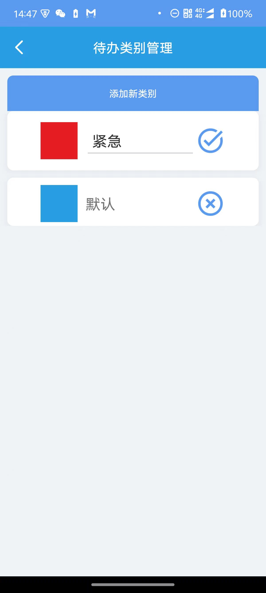
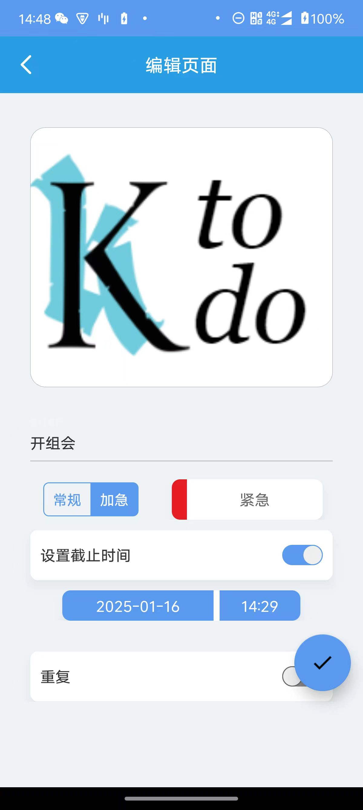
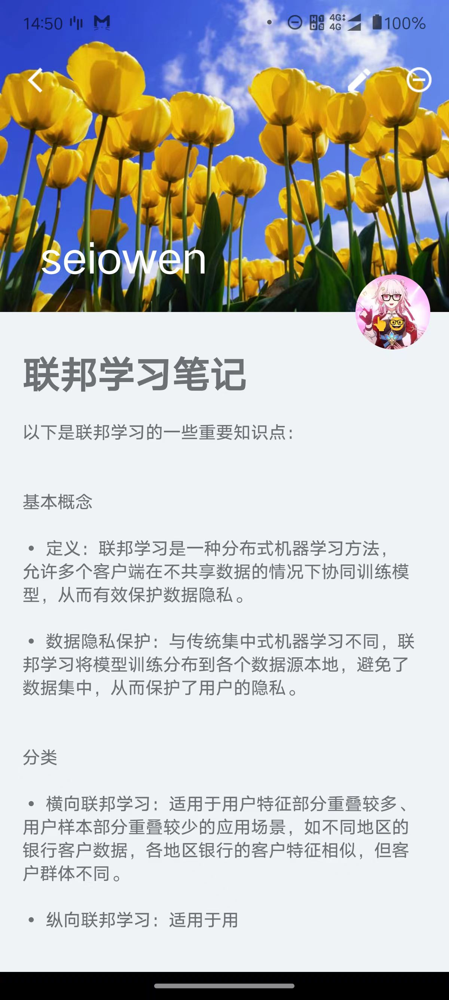
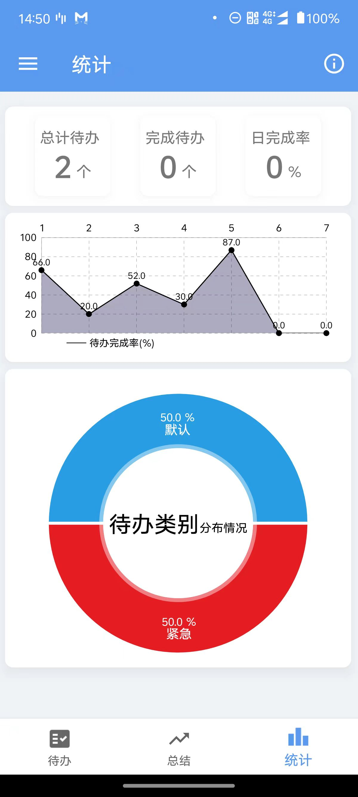
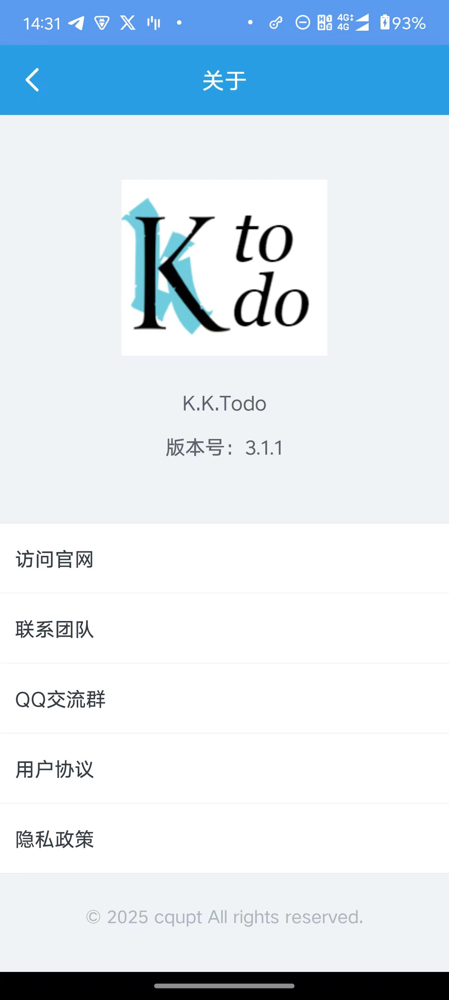

# K.K.Todo

K.K.Todo是一款可以记录你的待办事项、课程笔记总结，以及待办事项完成度统计的APP。

界面基于一款功能强大的美化框架XUI构建而成，界面跳转使用了XPage进行页面管理。

在此特别感谢 XUI、Xpage 的作者[**xuexiangjys**](https://gitee.com/xuexiangjys) 

## 主要功能

### 1 登录与注册

- 需要邮箱+密码登录。通过的云服务器搭建的MySQL实现。由于时间紧迫和服务器调试原因，验证码登录功能不太完善。
- 开发者是点击右上角的离线登录进去的。
- 登录前会有一个《温馨提示》弹窗。

### 2 主界面的构建

- 主要基于Xpage实现页面的跳转。

- 主界面显示待办事项，第一排序项为是否加急（小火苗标志），第二排序项为类别。
- 类别通过待办前方的颜色条来分类。

### 3 侧边栏功能 

点击右上角的三横线图标，可以看到左边的侧边栏。

- 重复待办管理：用于筛选和删除周期重复性待办
- 代办类别管理：用于添加或删除待办类别
- 回收站：用于恢复或删除之前消除掉的待办

### 4 类别管理

- 首次启动会给一个蓝色的“默认”类别
- 点击“添加新类别”，可以选择不同的颜色搭配不同的待办类别

### 5 回收站

- 已完成非重复待办会直接删除，未完成待办会进入垃圾箱。

- 已完成重复待办也会进入垃圾箱，但会在一定时间之后自动从垃圾箱恢复。

- 在垃圾箱进行二次删除，是彻底删除。

### 6 重复待办管理

提供三个重复选择，点击可查看该重复类型的待办有哪些。 

### 7 待办添加页面

该页面为您想要添加的待办事项提供以下设置：

- 事件名
- 常规/加急（加急有小火苗标注）
- 类别颜色
- 截止时间
- 重复（每日/每周/每月）

### 8 总结界面

该页面展示你的总结笔记，适合记录课程知识、小知识、工作笔记之类的。实际上这些内容会存储在MySQL的Summary表格里面。

每一条总结有两个基本元素：

- 标题
- 正文

### 9 统计页面

统计页面主要是使用了MPAndroidChart进行页面的美化。

### 10 关于APP

展示APP的图标、版本号、作者的github页面。（注：QQ交流群是XUI原作者的群）

